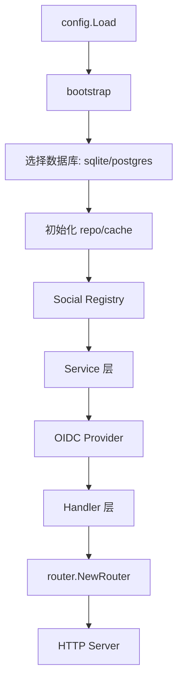
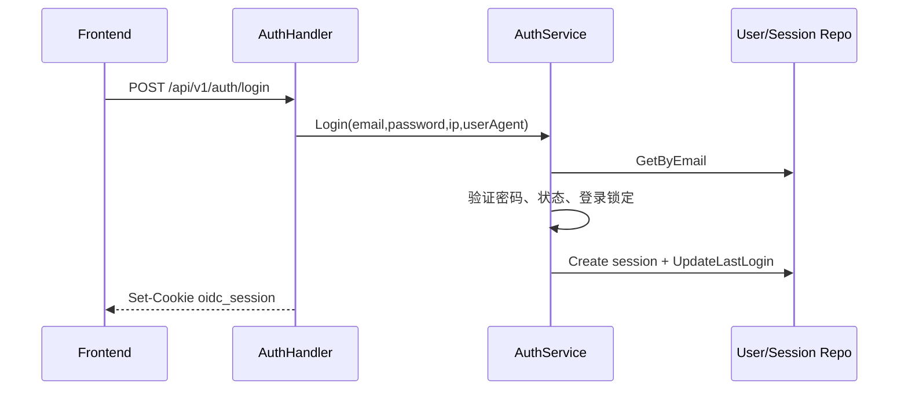
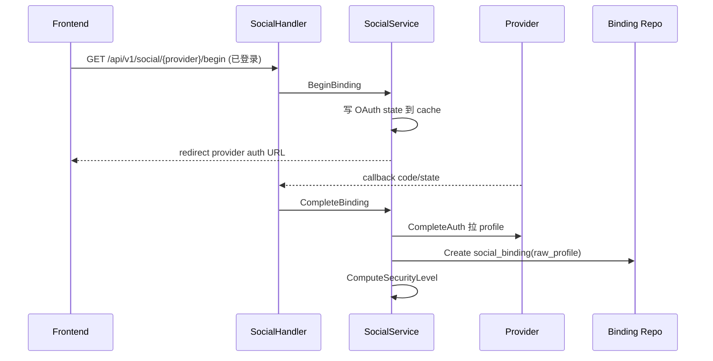
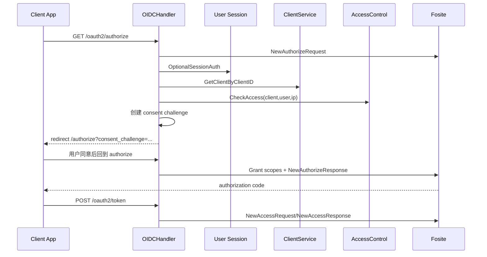
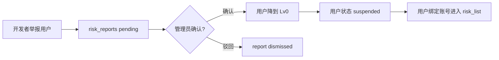
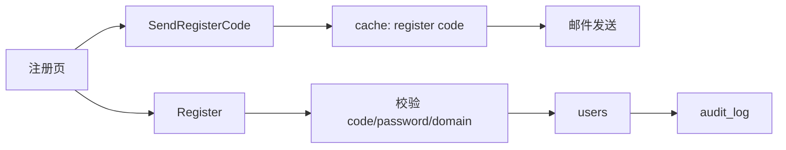
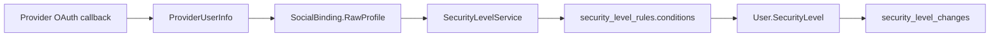
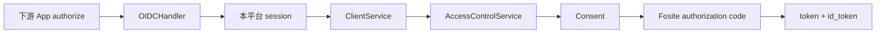
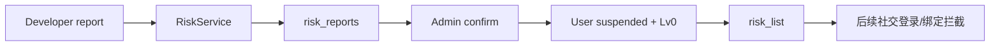

# OIDC Platform AI 快速上手技术文档

> 目标：让后续接手的 AI 或工程师不需要从零扫完整仓库，就能理解项目边界、数据流、模块关系、常见修改入口和验证方式。

## 1. 项目一句话定位

这是一个自托管 OIDC / OAuth2 身份认证平台。用户在平台内通过邮箱注册登录，并绑定 GitHub、Google、GitLab、Gitee、Discord、Microsoft、Apple、Telegram、QQ、微信、手机号、自定义 OAuth2 等身份来源来提升“信任等级”。下游业务系统只需要接入本平台的标准 OIDC 端点，并配置最低信任等级、邮箱验证要求和访问规则，即可获得统一认证、准入控制和基础风控能力。

核心产品形态：

- 用户中心：注册、登录、找回密码、邮箱验证、社交绑定、会话、授权应用、Passkey、信任等级查看。
- 开发者门户：创建 OIDC 客户端、管理密钥和回调地址、查看授权用户、举报/拉黑用户。
- 管理后台：用户、客户端、Provider、信任等级规则、系统设置、审计日志、签名密钥、风控列表。
- 标准协议服务：`/.well-known/openid-configuration`、`/oauth2/authorize`、`/oauth2/token`、`/oauth2/userinfo`、`/jwks.json`。

## 2. 技术栈和运行命令

### 后端

- 语言：Go `1.25.6`，module 为 `github.com/anthropic/oidc-platform`。
- HTTP 路由：`chi`。
- OIDC/OAuth2 引擎：`ory/fosite`。
- 配置：`viper`，支持 YAML + `OIDC_*` 环境变量覆盖。
- 存储：SQLite 或 PostgreSQL。
- 缓存：SQLite 模式默认内存缓存；PostgreSQL 模式使用 Redis。
- Passkey：`go-webauthn/webauthn`。
- 密码：Argon2id。

### 前端

- Vue 3 + Vite + TypeScript + Pinia + Vue Router + Vue I18n。
- API 统一走 `/api/v1`，fetch 带 `credentials: 'same-origin'`。

### 常用命令

```bash
# 后端测试
go test ./...

# 后端格式化
gofmt -w <go files>

# 前端构建
cd frontend && npm run build

# 前端开发
cd frontend && npm run dev

# 构建后端二进制
go build -o oidc-platform ./cmd/server

# Docker Compose 启动 Postgres + Redis + App
cp .env.example .env
docker compose up --build
```

### 当前已验证命令

最近一次验证已通过：

```bash
go test ./...
cd frontend && npm run build
```

## 3. 目录地图

```text
cmd/server/                  服务启动入口、依赖注入、种子数据、后台任务
configs/                     YAML 配置，含 config.yaml / config.sqlite.yaml
db/migrations/               数据库迁移，PostgreSQL 风格；SQLite 适配器内有兼容迁移执行
db/queries/                  sqlc 查询定义，当前仓库实际主要使用手写 repository
frontend/                    Vue 3 SPA
internal/adapter/            外部系统和基础设施适配层
  memcache/                  内存缓存
  redis/                     Redis 缓存
  smtp/                      邮件发送
  social/                    第三方 OAuth/OIDC Provider
  sqlite/                    SQLite 仓储实现
  postgres/                  PostgreSQL 仓储实现
internal/config/             配置结构和加载逻辑
internal/domain/             领域数据结构
internal/handler/            HTTP handler 和中间件
internal/oidcprovider/       fosite 封装、OIDC session/claims
internal/port/               接口边界：repository、cache、email、social provider 等
internal/router/             HTTP 路由总表
internal/service/            业务服务层
```

前端目录：

```text
frontend/src/api/client.ts       API 包装
frontend/src/router/index.ts     路由和权限守卫
frontend/src/stores/auth.ts      登录态、用户信息、开发者权限
frontend/src/i18n/               中英文文案
frontend/src/layouts/            公开页、登录页、用户中心、开发者、管理员布局
frontend/src/pages/              页面组件
frontend/src/composables/        公共组合逻辑，如 public config、Turnstile、密码策略
```

## 4. 运行时组装关系

启动入口：`cmd/server/main.go`。

核心流程：



`cmd/server/bootstrap.go` 做了大部分运行时组装：

- 根据 `database.driver` 选择 SQLite 或 PostgreSQL。
- SQLite：`internal/adapter/sqlite` + `memcache`。
- PostgreSQL：`internal/adapter/postgres` + `redis`。
- 初始化所有 repository。
- 初始化 `SecretCipher`，用于客户端密钥加密。
- 初始化 Social Provider Registry。
- 初始化 SMTP sender。
- 初始化业务服务。
- 初始化 Passkey/WebAuthn。
- 加载或创建 RSA signing key。
- 创建 fosite OAuth2/OIDC provider。
- 创建所有 handler。
- 启动后台任务。
- 种子管理员、Provider 配置、全局设置。
- 找到 `frontend/dist` 并交给 SPA handler。

后台任务：

- 每 15 分钟清理过期用户 session。
- 每 1 小时重算全部用户信任等级。
- 如果 `social_auth_sync.enabled=true`，定期同步第三方绑定授权状态。

## 5. 配置模型

配置入口：`internal/config/config.go`。

加载规则：

- 配置文件名：`config.yaml`。
- 搜索路径：`./configs`、`.`、`/etc/oidc`。
- 环境变量前缀：`OIDC_`。
- `.` 会映射为 `_`，如 `server.public_url` 可由 `OIDC_SERVER_PUBLIC_URL` 覆盖。

关键配置：

```text
server.host / port / public_url / issuer
database.driver / dsn / postgres host 等
redis.host / port
session.cookie_name / secure / same_site / ttl
security.password_* / max_login_attempts / lockout_duration
oauth2.<provider>.*
social_auth_sync.enabled / interval / batch_size
smtp.*
secrets.client_secret_encryption_key
webauthn.rp_id / rp_origin / rp_display_name
admin.email / admin.password
```

常用文件：

- `configs/config.yaml`：默认主配置。
- `configs/config.sqlite.yaml`：SQLite 最小配置。
- `.env.example`：Docker Compose 环境变量模板。
- `docker-compose.yml`：PostgreSQL + Redis + App。

注意：`Dockerfile` 只构建 Go 服务并复制 `configs`、`db/migrations`。如果要容器内服务前端，需保证构建上下文里有可用的前端产物，或调整 Dockerfile 先构建 `frontend/dist`。

## 6. HTTP 路由总览

路由入口：`internal/router/router.go`。

### 公开路由

```text
GET  /healthz
GET  /readyz
GET  /.well-known/openid-configuration
GET  /jwks.json
```

### OIDC / OAuth2

```text
GET  /oauth2/authorize
POST /oauth2/token
POST /oauth2/revoke
POST /oauth2/introspect
GET  /oauth2/userinfo
POST /oauth2/userinfo
```

`/oauth2/authorize` 支持平台登录态检查、客户端准入检查、用户同意页挑战。

### API `/api/v1`

公开设置：

```text
GET /api/v1/settings/public
GET /api/v1/settings/password-policy
```

认证：

```text
POST /api/v1/auth/register/code
POST /api/v1/auth/register
POST /api/v1/auth/login
POST /api/v1/auth/logout
POST /api/v1/auth/verify-email
POST /api/v1/auth/forgot-password
POST /api/v1/auth/reset-password
POST /api/v1/auth/passkey/begin
POST /api/v1/auth/passkey/finish
```

社交登录/绑定：

```text
GET /api/v1/social/providers
GET /api/v1/social/{provider}/begin
GET /api/v1/social/{provider}/callback
```

登录用户：

```text
GET    /api/v1/me
PUT    /api/v1/me
PUT    /api/v1/me/alias
PUT    /api/v1/me/password
GET    /api/v1/me/bindings
DELETE /api/v1/me/bindings/{provider}
GET    /api/v1/me/security-level
POST   /api/v1/me/resend-verification
GET    /api/v1/me/sessions
DELETE /api/v1/me/sessions/{id}
GET    /api/v1/me/authorized-apps
DELETE /api/v1/me/authorized-apps/{clientId}
```

用户 Passkey：

```text
POST   /api/v1/me/passkeys/register/begin
POST   /api/v1/me/passkeys/register/finish
GET    /api/v1/me/passkeys
DELETE /api/v1/me/passkeys/{id}
PUT    /api/v1/me/passkeys/{id}
```

OIDC 同意页：

```text
GET  /api/v1/consent/context
POST /api/v1/consent/accept
POST /api/v1/consent/reject
```

开发者门户：

```text
GET    /api/v1/developer/status
GET    /api/v1/developer/apps
POST   /api/v1/developer/apps
GET    /api/v1/developer/apps/{id}
PUT    /api/v1/developer/apps/{id}
DELETE /api/v1/developer/apps/{id}
POST   /api/v1/developer/apps/{id}/rotate-secret
GET    /api/v1/developer/apps/{id}/users
POST   /api/v1/developer/apps/{id}/users/{user_id}/block
DELETE /api/v1/developer/apps/{id}/users/{user_id}/block
POST   /api/v1/developer/apps/{id}/users/{user_id}/report
POST   /api/v1/developer/apps/{id}/report-user
```

管理员：

```text
/api/v1/admin/users...
/api/v1/admin/clients...
/api/v1/admin/security-rules...
/api/v1/admin/providers...
/api/v1/admin/alias-restrictions...
/api/v1/admin/settings...
/api/v1/admin/audit-log
/api/v1/admin/stats
/api/v1/admin/keys...
/api/v1/admin/risk...
```

管理员路由都需要 session + `admin` 或 `super_admin`。

## 7. API 响应约定

定义在 `internal/handler/response.go`。

普通 API 响应统一包裹：

```json
{
  "success": true,
  "data": {},
  "meta": {
    "total": 100,
    "offset": 0,
    "limit": 20
  }
}
```

错误：

```json
{
  "success": false,
  "error": {
    "code": "invalid_input",
    "message": "..."
  }
}
```

例外：OIDC 标准端点和 `/oauth2/userinfo` 会按协议或 raw JSON 输出。

请求 JSON 解码使用 `DecodeJSON`，开启 `DisallowUnknownFields`，所以前端传多余字段会被拒绝。

用户身份字段边界：

- `id`：内部 UUID，供数据库外键、session、管理端操作路径、开发者应用用户封禁/举报等内部操作使用。
- `uid`：面向用户展示和搜索的纯数字 UID，不能替代内部主键。
- OIDC `sub` 默认仍使用内部 UUID，避免破坏已有客户端的用户关联。
- 前端显示“UID”时只展示 `uid`；需要调用操作接口时传 `id`。

## 8. 后端分层和模块边界

### 8.1 domain 层

路径：`internal/domain/`。

主要领域对象：

| 文件 | 作用 |
| --- | --- |
| `user.go` | 用户、社交绑定、绑定状态、授权检查状态 |
| `client.go` | OIDC 客户端、访问规则、开发者用户摘要 |
| `security_level.go` | 信任等级规则、条件类型、等级变更记录 |
| `provider.go` | Provider 枚举、Provider 配置、自定义 OAuth2 配置解析 |
| `session.go` | 平台用户 session |
| `risk.go` | 风控举报、风控名单、审计日志、签名密钥等 |
| `passkey.go` | Passkey/WebAuthn 凭据 |

领域层只放数据结构和轻量判断，不直接访问数据库或 HTTP。

### 8.2 port 层

路径：`internal/port/`。

作用是定义接口边界：

- `repository.go`：所有 repository interface。
- `cache.go`：缓存 interface。
- `email.go`：邮件发送 interface。
- `social_provider.go`：社交 Provider interface 和 Registry。
- `sms_provider.go`：短信能力边界。

新增业务能力时优先在 port 层加接口，再在 adapter 层实现。

### 8.3 adapter 层

路径：`internal/adapter/`。

| 子目录 | 作用 |
| --- | --- |
| `sqlite/` | SQLite repository、迁移、fosite store |
| `postgres/` | PostgreSQL repository、迁移、fosite store |
| `redis/` | Redis cache 实现 |
| `memcache/` | 内存 cache 实现 |
| `smtp/` | 邮件发送 |
| `social/` | GitHub/Google/Discord 等 Provider 适配 |

SQLite 和 PostgreSQL 的 repo 名称基本一一对应。修改持久化字段时通常要同步：

1. `db/migrations/*.sql`
2. `internal/domain/*.go`
3. `internal/port/repository.go`
4. `internal/adapter/sqlite/*_repo.go`
5. `internal/adapter/postgres/*_repo.go`

### 8.4 service 层

路径：`internal/service/`。

| 服务 | 责任 |
| --- | --- |
| `AuthService` | 注册、登录、登出、邮箱验证、找回密码、密码修改、登录锁定 |
| `SessionService` | session 创建、读取、撤销、cookie 生命周期相关辅助 |
| `SocialService` | 社交绑定、社交登录、Provider profile 保存、绑定状态同步 |
| `SecurityLevelService` | 信任等级规则评估、等级重算、等级详情和缺失条件 |
| `ClientService` | OIDC 客户端 CRUD、密钥加密/解密/轮换、配置校验 |
| `AccessControlService` | 客户端准入：最低等级、邮箱验证、邮箱/IP/用户 allow/deny、别名限制 |
| `AdminService` | 管理端聚合操作：用户、Provider、设置、签名密钥、Passkey 等 |
| `DeveloperHandler` 依赖的服务组合 | 开发者应用管理和用户举报入口 |
| `RiskService` | 滥用举报、管理员确认/驳回、风控名单、降级/封禁执行 |
| `PasskeyService` | WebAuthn 注册和登录仪式、凭据管理 |
| `SecretCipher` | OIDC client secret 加密 |
| `password_policy.go` / `password.go` | 密码策略和 Argon2id 哈希 |

服务层是业务规则核心。Handler 只做 HTTP 参数解析、响应映射和上下文提取。

### 8.5 handler 层

路径：`internal/handler/`。

| Handler | 作用 |
| --- | --- |
| `AuthHandler` | `/api/v1/auth/*` |
| `SocialHandler` | `/api/v1/social/*` |
| `UserInfoHandler` | `/api/v1/me/*` |
| `DeveloperHandler` | `/api/v1/developer/*` |
| `AdminHandler` | `/api/v1/admin/*` |
| `OIDCHandler` | `/oauth2/*` 和 consent API |
| `WellKnownHandler` | discovery 和 JWKS |
| `PasskeyHandler` | Passkey API |
| `HealthHandler` | 健康检查 |
| `SPAHandler` | 前端 SPA fallback |

中间件在 `internal/handler/middleware/`：

- session 鉴权、可选 session 鉴权。
- admin 权限检查。
- CORS。
- request id。
- logging。
- rate limit。
- Turnstile。

## 9. 核心数据模型和数据库表

主要表来自 `db/migrations/000001_initial.up.sql`，后续迁移补充风险、Provider 排序、Passkey 等。

核心表：

| 表 | 作用 |
| --- | --- |
| `users` | 平台用户，本地邮箱、密码哈希、角色、状态、信任等级 |
| `social_bindings` | 用户绑定的第三方账号，含 token、状态、`raw_profile` |
| `security_level_rules` | 信任等级规则，`conditions` 是 JSON |
| `security_level_changes` | 信任等级变更审计 |
| `oidc_clients` | 下游 OIDC 客户端 |
| `client_access_rules` | 客户端访问 allow/deny 规则 |
| `oauth2_authorization_codes` | fosite 授权码存储 |
| `oauth2_access_tokens` | fosite access token 存储 |
| `oauth2_refresh_tokens` | fosite refresh token 存储 |
| `oauth2_oidc_sessions` | OIDC session/consent 数据 |
| `oauth2_pkce_requests` | PKCE 请求存储 |
| `signing_keys` | OIDC 签名密钥 |
| `user_sessions` | 平台登录 session |
| `provider_configs` | 后台配置的 Provider |
| `global_settings` | 平台开关和全局设置 |
| `alias_restrictions` | 用户 alias 保留/禁用规则 |
| `audit_log` | 审计日志 |
| `risk_reports` | 开发者/管理员风控举报 |
| `risk_list` | 风控黑名单 |
| `passkey_credentials` | WebAuthn/Passkey 凭据 |

`social_bindings.raw_profile` 很关键：Provider 拉到的原始 profile 会被保存，信任等级规则可从这里读取字段。

## 10. 认证、登录和 OIDC 流程

### 10.1 本地邮箱密码登录



登录成功后前端 `auth.fetchUser()` 读取 `/api/v1/me`。

### 10.2 社交绑定



绑定后会重算信任等级。

### 10.3 社交登录

未登录状态访问 `/api/v1/social/{provider}/begin` 会进入 login 模式。callback 后如果 Provider UID 已绑定，则更新绑定 profile/token 并创建本平台 session；如果未绑定，可能按配置执行社交注册或返回错误。

### 10.4 OIDC 授权码流程



准入检查位置：`internal/handler/oidc_handler.go` + `internal/service/access_control_service.go`。

## 11. 信任等级规则系统

核心文件：

- `internal/domain/security_level.go`
- `internal/service/security_level_service.go`
- `frontend/src/pages/admin/security-rules.vue`

规则存储在 `security_level_rules.conditions` JSON 中，不改表结构即可扩展。

### 11.1 规则结构

```json
{
  "operator": "AND",
  "rules": [
    {
      "type": "provider_account_age_days",
      "provider": "github",
      "field": "created_at",
      "operator": "gte",
      "min_days": 180
    }
  ]
}
```

旧规则仍兼容：

```json
{
  "operator": "AND",
  "rules": [
    {
      "provider": "github",
      "min_binding_days": 30
    }
  ]
}
```

旧规则会被解释为 `binding_age_days`。

### 11.2 条件类型

| type | 含义 | 主要字段 |
| --- | --- | --- |
| `provider_bound` | 已绑定某平台；provider 空表示任意活跃绑定 | `provider` |
| `binding_age_days` | 绑定时长 | `provider`, `operator`, `min_days` |
| `provider_account_age_days` | 第三方账号创建时长，如 GitHub `created_at` | `provider`, `field`, `operator`, `min_days` |
| `provider_email_verified` | Provider 明确返回邮箱验证状态 | `provider`, `operator`, `value` |
| `provider_email_domain` | Provider 邮箱域名 | `provider`, `values` |
| `provider_raw_number` | RawProfile 数字字段 | `provider`, `field`, `operator`, `value` |
| `provider_raw_string` | RawProfile 文本字段 | `provider`, `field`, `operator`, `value/values` |
| `provider_raw_bool` | RawProfile 布尔字段 | `provider`, `field`, `operator`, `value` |
| `user_email_domain` | 本地用户邮箱域名 | `values` |
| `user_created_age_days` | 本地用户注册天数 | `operator`, `min_days` |
| `user_has_verified_email` | 本地用户邮箱已验证 | `operator`, `value` |

比较方式：

- 数字：`gte`, `gt`, `lte`, `lt`, `eq`, `neq`，也兼容 `>=`, `>`, `<=`, `<`, `=`, `==`, `!=`。
- 字符串：`eq`, `neq`, `contains`, `prefix`, `suffix`, `regex`, `in`。
- 布尔：`eq`, `neq`。

### 11.3 评估原则

- `SecurityLevelService.ComputeSecurityLevel` 会读取用户、规则、绑定，然后从高等级到低等级排序匹配。
- 同等级按 `priority` 从高到低。
- 首个命中规则决定用户等级。
- 只使用 active binding；已解绑、禁用、过期等非活跃绑定不参与。
- `provider` 为空表示任意活跃绑定。
- `RawProfile` 路径支持点路径，如 `profile.company`。
- 时间支持 RFC3339Nano、RFC3339、`2006-01-02 15:04:05`、`2006-01-02` 和 unix timestamp。
- GitHub 账号注册天数必须来自 `RawProfile.created_at`，不能回退到绑定时间。
- 邮箱验证未知态不会被伪装成 false；条件不会匹配。

### 11.4 Provider RawProfile 标准化

文件：`internal/adapter/social/raw_profile.go`。

目标：在保留 Provider 原始字段的基础上，稳定派生通用字段：

- `email`
- `email_domain`
- `email_verified`：只有 Provider 明确提供可靠验证状态才写入。

各 Provider 的字段映射集中在 `internal/adapter/social/*.go`。

### 11.5 前端规则编辑器

页面：`frontend/src/pages/admin/security-rules.vue`。

支持：

- 新旧规则显示和编辑兼容。
- 条件类型选择。
- provider 推荐 + 可手填，支持 `custom_` / `oauth_` 自定义 Provider key。
- RawProfile 字段推荐 + 可手填路径。
- 数字、字符串、布尔、域名列表输入。
- GitHub 常用预设：`created_at`、`followers`、`following`、`public_repos`、`public_gists`。

文案：

- `frontend/src/i18n/zh.ts`
- `frontend/src/i18n/en.ts`

测试：

- `internal/service/security_level_service_test.go`

## 12. Provider 系统

核心接口：`internal/port/social_provider.go`。

Provider 需要实现：

```text
Name
BeginAuth
CompleteAuth
SupportsRefresh
RefreshToken
```

可选实现：`TokenValidatingProvider`，用于后续授权状态同步。

Registry：`internal/adapter/social/registry.go`。

Provider 来源：

1. 静态配置 `oauth2.<provider>`。
2. 数据库存储 `provider_configs`，由管理后台配置。

支持内置 Provider：

```text
github, google, gitlab, gitee, discord, telegram,
microsoft, apple, qq, wechat, phone
```

自定义 OAuth2 Provider：

- key 必须通过 `domain.IsValidCustomProviderKey`。
- key 需要以 `custom_` 或 `oauth_` 开头。
- 配置字段来自 `ProviderConfig.ExtraConfig`，例如授权端点、token 端点、userinfo 端点、字段路径等。

新增 Provider 的典型步骤：

1. 在 `internal/domain/provider.go` 增加常量和 `AllProviders`。
2. 在 `internal/adapter/social/` 增加 Provider 实现。
3. 在 `registry.go` 和 `cmd/server/bootstrap.go` 接入构造逻辑。
4. 在后台 Provider 页面和 i18n 增加展示字段。
5. 确认 `RawProfile` 字段标准化，不伪造不可证明字段。

## 13. 客户端和准入控制

客户端模型：`internal/domain/client.go`。

`OIDCClient` 关键字段：

- `ClientID`
- `ClientSecretEncrypted`
- `RedirectURIs`
- `GrantTypes`
- `ResponseTypes`
- `Scopes`
- `TokenEndpointAuthMethod`
- `MinSecurityLevel`
- `RequireEmailVerified`
- `IsConfidential`
- `IsActive`
- `OwnerUserID`

客户端服务：`internal/service/client_service.go`。

负责：

- 创建/更新客户端。
- 校验回调地址、grant type、scope、安全等级。
- 生成和加密 client secret。
- 轮换 secret。
- 验证 secret。

准入控制：`internal/service/access_control_service.go`。

检查顺序：

1. 客户端是否 active。
2. 用户状态是否 active。
3. 用户信任等级是否达到 `client.MinSecurityLevel`。
4. 客户端是否要求本地邮箱已验证。
5. `client_access_rules` 中的 user/email/email_domain/ip allow/deny。

注意：信任等级规则决定 `User.SecurityLevel`；客户端准入只消费这个等级并叠加自己的规则。

## 14. 风控系统

核心文件：

- `internal/domain/risk.go`
- `internal/service/risk_service.go`
- `frontend/src/pages/admin/risk.vue`
- `frontend/src/pages/developer/apps/[id]/users.vue`

流程：



`RiskService.ReportUser` 有自动升级逻辑：同一目标用户已有足够 confirmed reports 时，会自动确认当前报告并执行风控。

社交绑定/登录时会检查 `risk_list`，命中则阻止。

## 15. Passkey / WebAuthn

核心文件：

- `internal/domain/passkey.go`
- `internal/service/passkey_service.go`
- `internal/handler/passkey_handler.go`
- `db/migrations/000007_passkey_credentials.up.sql`

配置：

```text
webauthn.rp_id
webauthn.rp_origin
webauthn.rp_display_name
```

开关：`global_settings.passkey_enabled`。

登录和注册 challenge 存在 cache 中，key 前缀为 `passkey:challenge:`，过期时间 60 秒。

前端使用 `@simplewebauthn/browser`。

## 16. 前端结构

### 16.1 应用入口

- `frontend/src/main.ts`：创建 Vue app，挂载 Pinia、i18n、router。
- `frontend/src/App.vue`：只放 `RouterView` 和全局 Toast。
- `frontend/src/api/client.ts`：统一 API client。
- `frontend/src/stores/auth.ts`：登录态、用户信息、开发者权限。

### 16.2 路由

文件：`frontend/src/router/index.ts`。

主分组：

| 路径 | 布局 | 页面 |
| --- | --- | --- |
| `/` | `DefaultLayout` | 首页、features、docs、privacy、terms |
| `/login` 等 | `AuthLayout` | 登录、注册、找回密码、重置、授权确认、邮箱验证 |
| `/me` | `DashboardLayout` | 用户中心、会话、绑定、安全、授权应用 |
| `/developer` | `DeveloperLayout` | 开发者首页、创建应用、应用详情、应用用户 |
| `/admin` | `AdminLayout` | 管理首页、用户、客户端、规则、Provider、设置、审计、密钥、风控 |

路由守卫：

- 首次进入会并发 `auth.fetchUser()` 和 `auth.fetchPublicSettings()`。
- `requiresAuth` 未登录跳 `/login?return_to=...`。
- 登录用户访问受保护区域时拉取 developer status。
- `requiresAdmin` 检查 `role`。
- `requiresDeveloper` 检查 developer access。

### 16.3 API client

`frontend/src/api/client.ts`：

- base path 固定为 `/api/v1`。
- 每个请求默认 JSON。
- 默认带 cookie。
- 非 2xx 或 `success=false` 直接 throw `Error(message)`。

新增前端 API 通常不需要新 client，只需要页面内调用：

```ts
api.get<T>('/path')
api.post<T>('/path', body)
api.put<T>('/path', body)
api.del<T>('/path')
```

### 16.4 页面入口索引

用户端：

```text
frontend/src/pages/login.vue
frontend/src/pages/register.vue
frontend/src/pages/forgot-password.vue
frontend/src/pages/reset-password.vue
frontend/src/pages/verify-email.vue
frontend/src/pages/authorize.vue
frontend/src/pages/me/index.vue
frontend/src/pages/me/bindings.vue
frontend/src/pages/me/security.vue
frontend/src/pages/me/sessions.vue
frontend/src/pages/me/authorized.vue
```

开发者：

```text
frontend/src/pages/developer/index.vue
frontend/src/pages/developer/create.vue
frontend/src/pages/developer/apps/[id].vue
frontend/src/pages/developer/apps/[id]/users.vue
```

管理员：

```text
frontend/src/pages/admin/index.vue
frontend/src/pages/admin/users.vue
frontend/src/pages/admin/clients.vue
frontend/src/pages/admin/security-rules.vue
frontend/src/pages/admin/providers.vue
frontend/src/pages/admin/settings.vue
frontend/src/pages/admin/audit.vue
frontend/src/pages/admin/keys.vue
frontend/src/pages/admin/risk.vue
```

Provider 配置组件：

```text
frontend/src/components/admin/providers/*.vue
```

### 16.5 i18n

文件：

```text
frontend/src/i18n/index.ts
frontend/src/i18n/zh.ts
frontend/src/i18n/en.ts
```

页面新增文案必须同步中英文，否则构建期不一定报错，但运行时可能显示 key。

## 17. 数据流速查

### 17.1 本地用户注册



### 17.2 社交绑定到信任等级



### 17.3 客户端授权



### 17.4 风控举报



## 18. 常见修改入口

### 18.1 新增后端 API

1. 在合适的 service 加业务方法。
2. 在 handler 中加 HTTP 方法。
3. 在 `internal/router/router.go` 注册路由。
4. 如需持久化，先改 domain/port/repo/migration。
5. 前端页面调用 `api.*`。
6. 补 i18n 和测试。

### 18.2 新增数据库字段

1. 改 `db/migrations`。
2. 改 `internal/domain`。
3. 改 `internal/port/repository.go` 如果接口变化。
4. 同步 `internal/adapter/sqlite` 和 `internal/adapter/postgres`。
5. 检查 JSON 序列化字段名。
6. 跑 `go test ./...`。

### 18.3 新增信任等级条件

1. `internal/domain/security_level.go` 新增 condition type 和字段。
2. `internal/service/security_level_service.go`：
   - `normalizeCondition`
   - `validateCondition`
   - `evaluateCondition`
   - 必要时 `conditionStatus`
3. Provider 字段来自 `RawProfile` 时，优先在 `internal/adapter/social/raw_profile.go` 或具体 provider 适配器补标准化。
4. 前端 `frontend/src/pages/admin/security-rules.vue` 增加编辑能力。
5. 中英文 i18n 增加文案。
6. `internal/service/security_level_service_test.go` 补回归测试。

### 18.4 新增 Provider

参考“Provider 系统”章节。

重点不要把不可证明字段伪造成可证明字段。例如邮箱验证只能在 Provider 明确返回 verified/verified_email/email_verified 时写入。

### 18.5 改 OIDC token claims

相关文件：

- `internal/oidcprovider/session.go`
- `internal/oidcprovider/claims.go`
- `internal/handler/oidc_handler.go`

`Authorize` 中会调用 `oidcprovider.NewSession` 和 `oidcprovider.AddCustomClaims`。

需要保证 `/oauth2/userinfo` 和 ID Token claims 语义一致。

### 18.6 改前端权限导航

相关文件：

- `frontend/src/router/index.ts`
- `frontend/src/stores/auth.ts`
- 各 layout：`frontend/src/layouts/*.vue`

开发者权限由 `/api/v1/developer/status` 决定，不只是 `security_level` 单字段。

## 19. 测试和验证建议

必跑：

```bash
go test ./...
cd frontend && npm run build
```

按修改范围补充：

| 修改范围 | 重点验证 |
| --- | --- |
| 认证/注册/密码 | 登录、注册、找回、锁定、邮箱域名限制 |
| 社交 Provider | begin/callback、profile 保存、绑定冲突、risk list |
| 信任等级 | 旧规则兼容、AND/OR、RawProfile 字段缺失、非活跃绑定过滤 |
| OIDC | discovery、authorize、consent、token、userinfo、client secret |
| 客户端准入 | min level、email verified、email/ip/user allow/deny |
| Passkey | begin/finish register、begin/finish login、challenge 过期 |
| 前端页面 | vue-tsc 构建、i18n key、API 路径、权限守卫 |

## 20. 已知工程注意点

- 工作区可能存在未提交改动；不要随意回退用户或其他任务的变更。
- 后端 handler 的 JSON 解码拒绝未知字段，前端 payload 要精准。
- SQLite 和 PostgreSQL repository 经常要同步改。
- `security_level_rules.conditions` 是 JSON，扩展规则优先保持旧结构兼容。
- `social_bindings.raw_profile` 是信任等级高级规则的重要依据，Provider 修改要谨慎。
- 邮箱验证不能靠 `email != ""` 判断。
- GitHub 注册天数必须读 GitHub profile 的 `created_at`。
- `provider` 允许自定义 key，但必须满足 `custom_` 或 `oauth_` 前缀规则。
- 前端构建会跑 `vue-tsc -b`，模板里的 TypeScript 类型断言容易导致构建失败，复杂转换放到 script 方法里。
- `OIDC_OAUTH2_SECRET` 少于 32 字符时会随机生成，重启后 OAuth session 不可持续。
- 启动时会自动创建 signing key；JWKS 来自 `signing_keys` 表。
- 默认全局设置会在启动时 seed，包括注册、登录、社交绑定、Passkey 开关。

## 21. 当前仓库状态提示

最近完成的关键增强：

- 信任等级规则已从旧的 `provider + min_binding_days` 扩展为可读 Provider RawProfile 的通用规则系统。
- GitHub 注册天数读取 `RawProfile.created_at`。
- Provider 邮箱验证未知态不会匹配。
- 管理端规则 UI 已支持新结构并兼容旧规则。
- 新增 `internal/adapter/social/raw_profile.go`。
- 新增 `internal/service/security_level_service_test.go`。

如果后续 AI 接手信任等级相关问题，优先看：

```text
internal/domain/security_level.go
internal/service/security_level_service.go
internal/service/security_level_service_test.go
internal/adapter/social/raw_profile.go
internal/adapter/social/*.go
frontend/src/pages/admin/security-rules.vue
frontend/src/i18n/zh.ts
frontend/src/i18n/en.ts
```

## 22. 最短接手路径

如果你是新 AI，只需要按这个顺序读：

1. 本文档。
2. `internal/router/router.go` 看系统入口和 API 边界。
3. `cmd/server/bootstrap.go` 看依赖如何组装。
4. 当前任务相关的 service 文件。
5. 当前任务相关的 handler 文件。
6. 如涉及存储，再看对应 domain、port 和 repo。
7. 如涉及前端，再看 `frontend/src/router/index.ts`、`frontend/src/api/client.ts`、目标页面和 i18n。

不要一开始全仓库泛读，除非任务本身是架构重构。